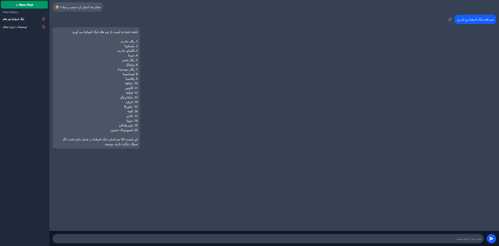
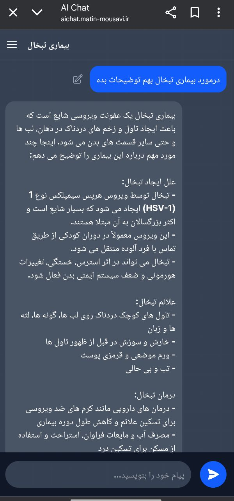
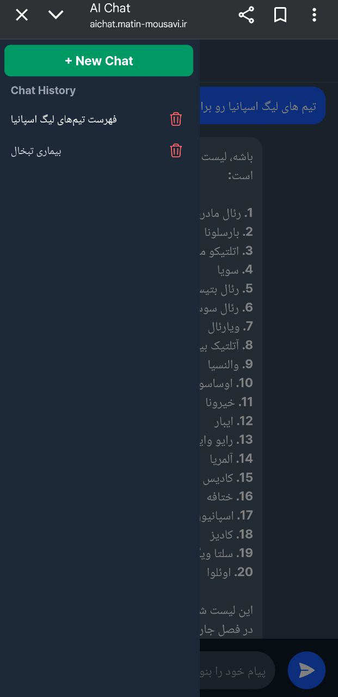

# 🤖 AIChat - دستیار هوشمند شخصی شما

یک اپلیکیشن چت فول‌استک، مدرن و کاملاً واکنش‌گرا که با استفاده از جدیدترین تکنولوژی‌های وب (Next.js 15, React 19) ساخته شده است. این پروژه به شما اجازه می‌دهد تا با مدل‌های مختلف هوش مصنوعی از طریق OpenRouter مکالمه کنید و تاریخچه گفتگوهای خود را مدیریت نمایید.

**✨ [مشاهده دموی زنده پروژه](https://aichat.matin-mousavi.ir/) ✨**

---

## 📸 نگاهی به پروژه

<p align="center">
  
</p>
<p align="center">
  <em>نمای اصلی اپلیکیشن در دسکتاپ</em>
</p>

<br/>

<p align="center">
  
  
</p>
<p align="center">
  <em>طراحی کاملاً واکنش‌گرا برای موبایل و قابلیت‌های پیشرفته مانند ویرایش پیام</em>
</p>

---

## 🔥 ویژگی‌های کلیدی

-   **معماری مدرن فول‌استک:** توسعه یافته با Next.js App Router و TypeScript برای عملکرد بالا و قابلیت نگهداری آسان.
-   **اتصال به چندین مدل AI:** با استفاده از OpenRouter، به راحتی می‌توان بین مدل‌های مختلفی مانند **Claude 3 Haiku**، **Mistral** و... جابجا شد.
-   **طراحی کاملاً واکنش‌گرا (Responsive):** تجربه کاربری یکپارچه در دسکتاپ، تبلت و موبایل، همراه با سایدبار مخفی‌شونده و حل مشکل رایج `100vh` در مرورگرهای موبایل.
-   **مدیریت کامل تاریخچه چت:**
    -   ذخیره تمام مکالمات در `localStorage` برای ماندگاری اطلاعات.
    -   قابلیت ساخت چت جدید، جابجایی بین چت‌ها و **حذف** مکالمات.
-   **عنوان هوشمند برای چت‌ها:** برای هر مکالمه جدید، یک عنوان کوتاه و مرتبط به صورت **خودکار توسط هوش مصنوعی** تولید می‌شود.
-   **ویرایش پیام و ادامه گفتگو:** کاربران می‌توانند پیام‌های خود را ویرایش کنند و هوش مصنوعی بر اساس پیام اصلاح‌شده، **پاسخ جدید و مرتبطی** ارائه می‌دهد.
-   **اصول معماری SOLID:** پروژه با رعایت اصول کدنویسی تمیز و **SOLID** طراحی شده تا کدی قابل فهم، قابل توسعه و قابل نگهداری داشته باشد.

---

## 🛠️ پشته فناوری (Tech Stack)

| دسته             | تکنولوژی                                  |
| :--------------- | :---------------------------------------- |
| **فریمورک اصلی** | Next.js 15 (App Router)                   |
| **زبان**         | TypeScript                                |
| **استایل‌دهی**   | Tailwind CSS                              |
| **منطق کلاینت**  | React 19, React Hooks                     |
| **بک‌اند**       | Next.js API Routes (Serverless Functions) |
| **ارتباط با AI** | OpenRouter API                            |
| **استقرار**      | Vercel                                    |

---

## 🚀 راه‌اندازی و اجرا در سیستم شخصی

برای اجرای این پروژه به صورت محلی، مراحل زیر را دنبال کنید:

**۱. کلون کردن ریپازیتوری:**

```bash
git clone [https://github.com/matinmousavi/AIChat.git](https://github.com/matinmousavi/AIChat.git)
cd aichat
```

**۲. نصب وابستگی‌ها:**

```bash
npm install
```

**۳. تنظیم متغیرهای محیطی:**
یک فایل به اسم `.env.local` در ریشه اصلی پروژه بسازید و کلید API خود را که از OpenRouter دریافت کرده‌اید، در آن قرار دهید.

```env
# .env.local
OPENROUTER_API_KEY="YOUR_OPENROUTER_KEY_HERE"
```

**۴. اجرای پروژه:**

```bash
npm run dev
```

حالا می‌توانید پروژه را در آدرس `http://localhost:3000` مشاهده کنید.

---

## 📄 لایسنس

این پروژه تحت لایسنس MIT منتشر شده است.
